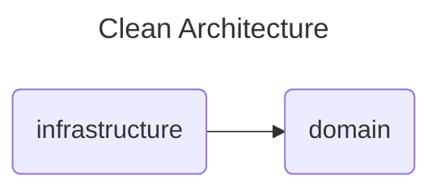
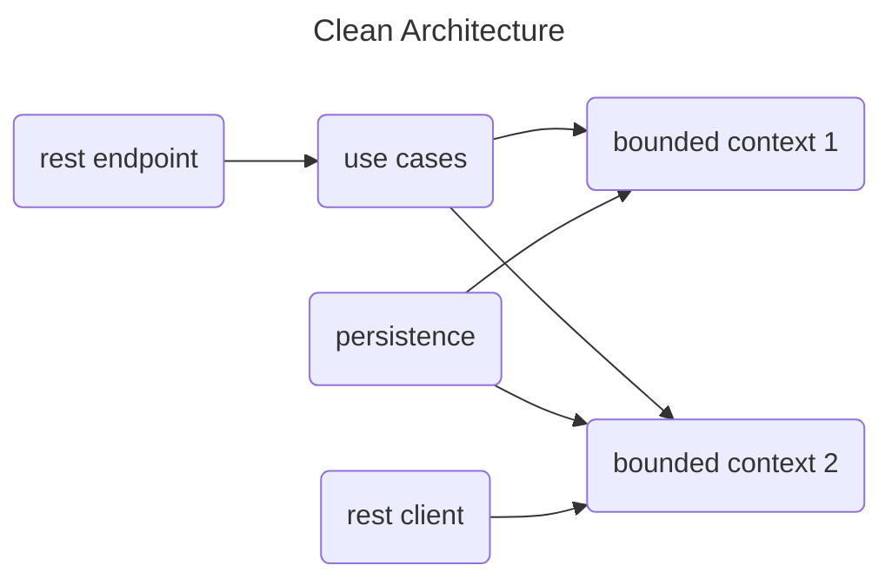

# clean-architecture

## Usage

Build
```bash
mvn clean install
```

Run
```bash
mvn spring-boot:run
```

## Architecture

```mermaid
---
title: Clean Architecture
---
flowchart LR
    domain(domain)
    infrastructure(infrastructure)
    infrastructure --> domain
```


```mermaid
---
title: Clean Architecture
---
flowchart LR
    useCases(use cases)
    boundedContext1(bounded context 1)
    boundedContext2(bounded context 2)
    restEndpoint(rest endpoint)
    persistence(persistence)
    restClient(rest client)
    restEndpoint --> useCases
    useCases --> boundedContext1
    useCases --> boundedContext2
    persistence --> boundedContext1
    persistence --> boundedContext2
    restClient --> boundedContext2
```