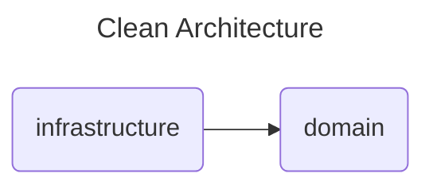
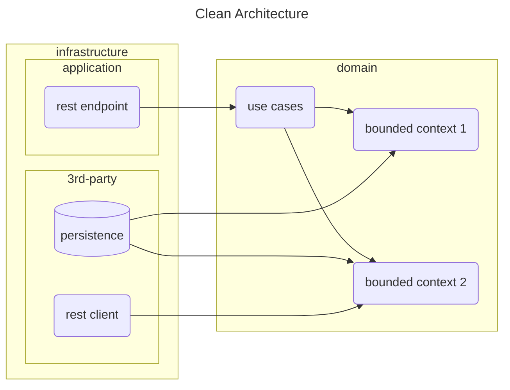

# clean-architecture

## Usage

Build
```bash
mvn clean install
```

Run
```bash
mvn spring-boot:run
```

```
http://localhost:8080/swagger-ui.html
http://localhost:8080/v3/api-docs
```

## Architecture


